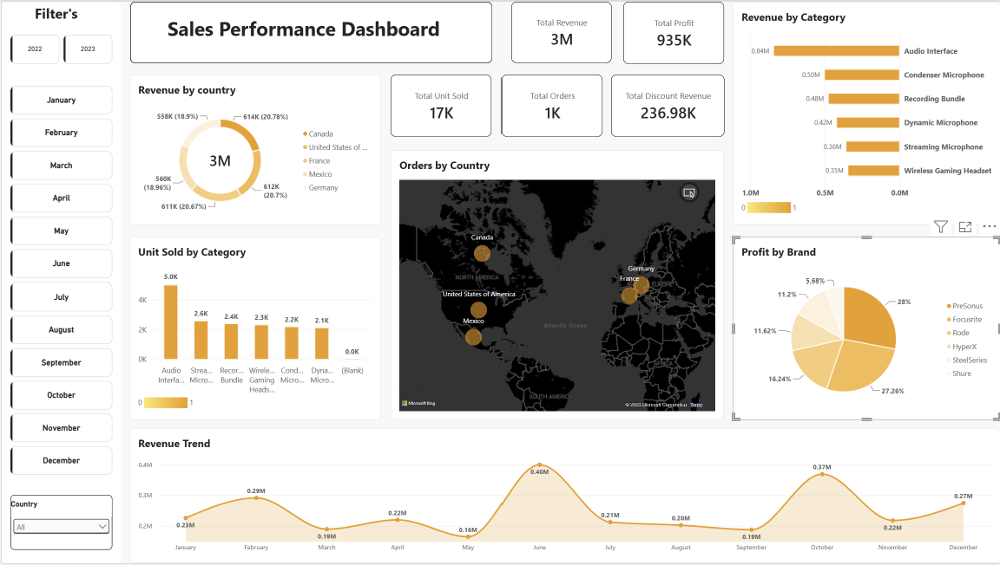

#  Sales Analytics Dashboard

An end-to-end Sales Analytics project built using **PostgreSQL and Power BI** to transform raw sales data into an interactive business dashboard.

The project focuses on understanding sales performance, revenue, profitability, products, countries, customer types, and discount patterns.

---

##  Project Overview

This project demonstrates a complete analytics workflow:

**Raw CSV Data → PostgreSQL → Data Model → Power BI → Interactive Dashboard**

I imported the raw CSV files into **PostgreSQL**, structured the data into relational tables, connected PostgreSQL with **Power BI**, and created an interactive dashboard to generate business insights.

<p align="center">
  
</p>

---

##  Tools & Technologies

- **PostgreSQL** – Data storage, table creation and SQL
- **Power BI** – Data modeling, DAX and dashboard development
- **SQL** – Data analysis and querying
- **Figma** – Dashboard UI and visual design
- **GitHub** – Project documentation and version control

---

##  Data Analytics Workflow

### 1. Raw Data
The project started with multiple CSV files containing sales, product and discount information.

### 2. PostgreSQL Database
The CSV files were **imported into PostgreSQL** and organized into separate tables:

- `product_sales`
- `product_data`
- `discount_data`

The tables were structured to create relationships between sales, products and discount information.

### 3. Power BI Connection
After preparing the database, I connected **PostgreSQL directly to Power BI** and imported the required tables for analysis.

### 4. Data Modeling & DAX
Created relationships between tables and developed DAX measures for important business KPIs.

### 5. Dashboard Design
Designed the dashboard layout in **Figma** and implemented the final interactive dashboard in **Power BI**.

---

##  Key KPIs

The dashboard focuses on:

| KPI | Description |
|---|---|
| 💰 Total Revenue | Total sales revenue generated |
| 📦 Total Units Sold | Total quantity of products sold |
| 🧾 Total Orders | Number of sales transactions |
| 📈 Total Profit | Revenue after product cost |

---

##  Dashboard Analysis

The dashboard provides insights into:

- Revenue trends over time
- Revenue by product category
- Revenue by country
- Sales by discount band
- Top-performing products
- Customer type performance
- Overall profitability

---

##  Business Insights

The dashboard helps answer questions such as:

- Which categories generate the highest revenue?
- Which countries are the strongest markets?
- Which products contribute the most to sales?
- How do discount bands affect sales performance?
- How much profit is generated from overall sales?
- How does revenue change over time?

---

##  Key DAX Measures

### Total Revenue

```DAX
Total Revenue =
SUMX(
    product_sales,
    product_sales[Units_Sold] *
    RELATED(product_data[Sale_Price])
)
